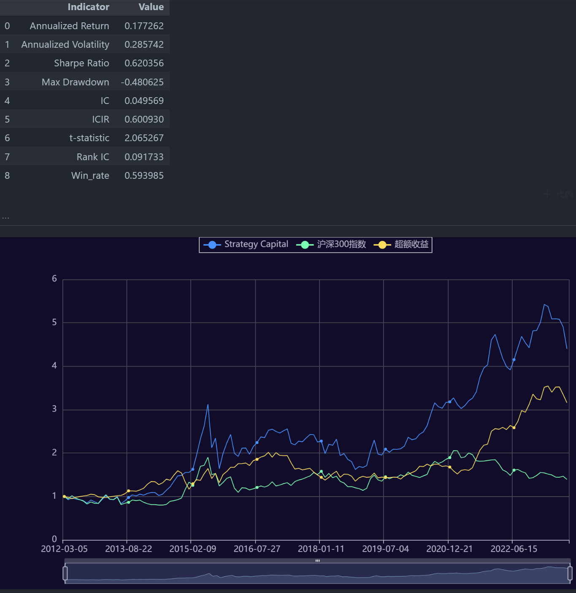

# Momentum_without_crashes
Jupyter Notebook of quantative intern in XXX Security, based on publishment named "Momentum Without Crashes"

This README provides an overview of a quantitative strategy that utilizes fractional differencing to create a momentum and mean-reversion based trading signal.

银河证券金融工程组实习期间的产出。一个基于分数差分方法的改进动量策略，完整代码可见html。

策略结果如下：
| Indicator | Value |
| ---: | ---: |
| Annualized Return | 0.177262 |
| Annualized Volatility | 0.285742 |
| Sharpe Ratio | 0.620356 |
| Max Drawdown | -0.480625 |
| IC | 0.049569 |
| ICIR | 0.600930 |
| t-statistic | 2.065267 |
| Rank IC | 0.091733 |
| Win_rate | 0.593985 |

## Background

We consider a set of $m$ assets and the vector of log-prices $p_t=\left(p_{t, 1}, \ldots, p_{t, m}\right)$ for time $t=$ $1, \ldots, T$. The log-return of asset $i$, denoted by $r_{t, i}$, is defined as the difference between its current $\log$-price $p_{t, i}$ and its previous log-price $p_{t-1, i}$. Hence we have

$$
r_{t, i}=p_{t, i}-p_{t-1, i}=(1-B) p_{t, i}, \quad t=2, \ldots, T,
$$

where $B$ is the backshift, or lag, operator applied to a time series; see, e.g., Hamilton (1994, Ch. 2) for a detailed presentation. This is a special case of the fractionally differenced log-price series, denoted by $p_{t, i}^{1}$ and defined as $p_{t, i}^{1} = (1-B)^d p_{t, i}$

for a real number $d$, which is referred to as the order of the fractional difference operator. Its expansion (from Newton's generalized binomial theorem) is straightforwardly shown to be given by

$$
(1-B)^d=\sum_{s=0}^{\infty}(-B)^s\left(\begin{array}{l}
d \\
s
\end{array}\right)=\sum_{s=0}^{\infty}(-B)^s \prod_{i=0}^{s-1} \frac{d-i}{s-i} .
$$

Textbook developments and presentations of fractional differencing in time series analysis can be found in Brockwell and Davis (1991, Ch. 13), Hamilton (1994, Ch. 15), and Box et al. (2016, Sec. 10.4.1). An infinite series representation of the fractionally differenced data $p_{t, i}^{1}$ can be expressed as

$$
p_{t, i}^{1}=\sum_{s=0}^{\infty} \pi_s p_{t-s, i}, \quad \text { with } \quad \pi_0=1, \quad \text { and } \quad \pi_s=(-1)^s \prod_{i=0}^{s-1} \frac{d-i}{s !}, \quad \text { for } \quad s>0.
$$

作者希望通过分数差分这一工具在“损失信息尽可能少”的前提下保持相应金融数据的平稳性，故其根据和收益率类似的$r_{it}$进行了相应的涉及分数差分的等价变形，并将其作为因子开发策略。

## Methodology

1. **FFT Computation for Fractional Differencing**:
   
   The Fast Fourier Transform (FFT) is utilized to compute the fractional differencing of a given time series:

$$
p_{t, i}=\sum_{s=0}^{\infty} \pi_s p_{t-s, i}
$$

2. **Visualization of Coefficients**:

    The coefficients, $\pi_s\$, are visualized for various values of \(d\). This helps in understanding the impact of the order of differencing on the series.

3. **Momentum and Reversion Signal**:
   
   By applying a mathematical transformation to yield $r_{it}$, we could using appromixation to get a factor which both representing momentum and reversion signal, which helps us reduce the possibity of momentum crash caused by reversion signal(detailed results are shown in html)
   
5. **Metrics Calculation**:

    Performance metrics like Sharpe ratio, Max Drawdown, IC, ICIR, t-statistic, Rank IC, and Win rate are calculated to evaluate the strategy's performance.
   
6. **Result**:

   

   

## Tools Used

- Python libraries: `decimal`, `pyecharts`, `numpy`, `scipy`
- Data Visualization: `pyecharts` (for plotting the coefficients and the differenced series)
- Performance Metrics: Spearman Rank correlation and others

## Conclusion

This quantitative strategy provides a unique approach to creating trading signals using fractional differencing. The performance metrics give insights into the strategy's potential profitability and risks.

